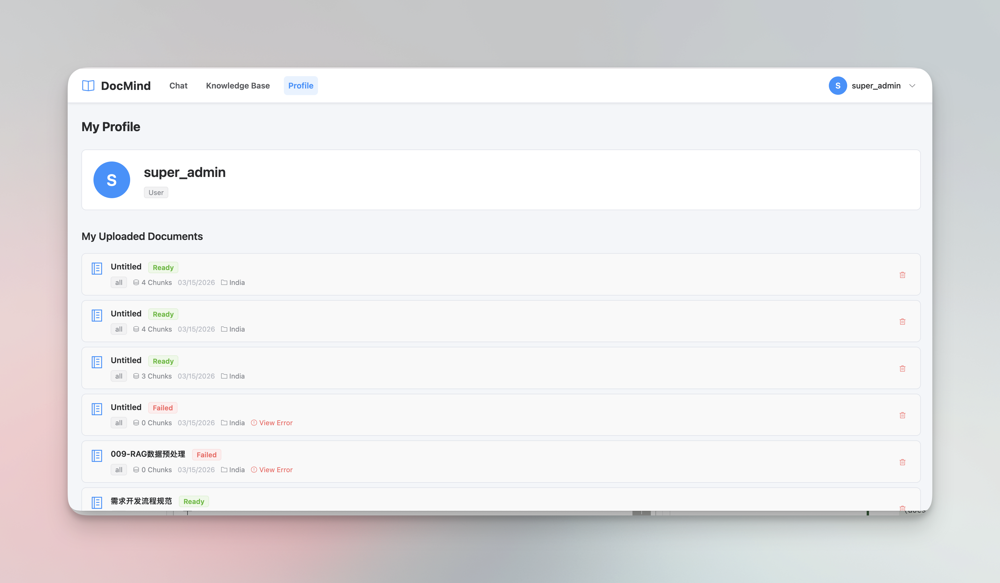

# DocMind

A robust, multi-tenant RAG (Retrieval-Augmented Generation) Knowledge Base system. DocMind seamlessly handles document ingestion, vector storage, and conversational retrieval with proper user data isolation.

## Screenshots

**Knowledge Base Dashboard**


**Document Management**



**Conversational Chat with Source Citations**


## Key Features

- **Knowledge-Base Isolation with RBAC**: Users authenticate with JWT and are scoped to knowledge bases with `user`, `admin`, and `super_admin` roles.
- **LangGraph-Driven Ingestion and Retrieval**: Both ingestion and chat retrieval are modeled as explicit workflows instead of ad-hoc request handlers.
- **Per-KB Embedding Identity**: Each knowledge base persists its own embedding provider, model, vector dimension, and connection settings to avoid vector drift.
- **Hybrid Retrieval Modes**: Confluence-backed KBs can retrieve either classic chunks or bounded full-document context (`full_doc`) depending on the use case.
- **Confluence Sync**: Optional Confluence integration supports KB-level root page binding, manual sync, scheduled sync, and sync job history inspection.
- **Image-Aware Ingestion**: Markdown image blocks can be skipped, OCR'd, or summarized with a multimodal model, depending on `IMAGE_PROCESSOR`.
- **Streaming Chat, API Keys, and OpenAI Compatibility**: The app supports SSE chat responses with citations, user-managed API keys, and a stateless `/v1/chat/completions` endpoint for OpenAI-compatible clients.
- **Operational Simplicity**: SQLite stores app metadata, Qdrant stores vectors, and collections are created dynamically per KB as `docmind_{kb_name}`.
- **Runtime-Editable System Settings**: Super-admins can update the active chat/retrieval/LLM settings at runtime without restarting the backend.

## Architecture & Tech Stack

### Backend
- **Framework**: Python 3.12+, FastAPI, Pydantic, Uvicorn
- **Package Manager**: `uv`
- **Workflow Orchestration**: LangGraph, LangChain
- **Vector Database**: Qdrant (Docker)
- **Embedding Model**: Per-knowledge-base embedding configuration (supports OpenAI-compatible endpoints and HuggingFace models)
- **LLM**: Any OpenAI-compatible endpoint, configured via runtime `system_settings` (with `.env` bootstrap defaults)
- **Relational DB**: SQLite

### Frontend
- **Framework**: Vue 3 (Composition API)
- **Build Tool**: Vite 8
- **UI Components**: Element Plus
- **State Management**: Pinia
- **Routing**: Vue Router 5
- **CSS**: Tailwind CSS
- **Package Manager**: pnpm

### Background Workers & Job Flow

DocMind runs two long-lived backend workers. `ConfluenceSyncWorker` operates at the knowledge-base level: it scans KBs with Confluence sync enabled, supports both scheduled sync and manual `Sync Now` triggers, and creates a `kb_sync_job` for each full sync run.

While executing a `kb_sync_job`, `ConfluenceSyncWorker` traverses the configured Confluence page tree, compares remote pages with locally tracked Confluence documents, and determines whether each page should be created, updated, or deleted. For created and updated pages, it fetches the latest content, writes the local source file, updates or rebuilds the `documents` record, and creates downstream `ingestion_jobs`. For deleted pages, it removes the corresponding local and vector data.

`IngestionQueueWorker` is the worker that performs document-level ingestion work. It continuously scans `ingestion_jobs` and runs the full ingest pipeline for each pending document: reading the file, splitting it into chunks, generating embeddings, writing vectors to Qdrant, and updating document and job status.

In practice, `kb_sync_job` represents a knowledge-base-level sync run, while `ingestion_job` represents a document-level ingest run. `ingestion_jobs` are created either when a user uploads a document manually or when a Confluence sync detects that a page must be created or refreshed.

For more detail, see [docs/backend_workers_and_jobs_overview.zh-CN.md](docs/backend_workers_and_jobs_overview.zh-CN.md).

## Advanced Ingestion & Preprocessing Pipeline

DocMind features a highly optimized, LangGraph-orchestrated document ingestion pipeline that addresses critical pain points in standard RAG architectures.

### 1. Strict Context-Preserving Chunking
* **Pain Point**: Traditional character-based splitters often slice through code blocks or separate paragraphs from their parent headers, causing context loss during retrieval.
* **Solution**: Custom state-machine-based Markdown splitter that slices by physical paragraphs (`\n\n`), dynamically tracks heading hierarchy and injects it into chunk metadata, and protects code blocks from being broken apart.

For detailed chunking behavior — including how `CHUNK_SIZE` and `CHUNK_OVERLAP` interact, which block types are protected from splitting, and how oversized paragraphs are handled — see [docs/FAQ.md](docs/FAQ.md).

### 2. LLM-Powered Code Summarization (Multi-Vector Retrieval)
* **Pain Point**: Raw code lacks natural language characteristics, causing semantic dilution when vectorized — users querying in natural language often miss the right code snippets.
* **Solution**: A dedicated LangGraph node intercepts chunks containing code, generates a keyword-dense natural language summary via LLM, and uses the summary for embedding while storing the original code in Qdrant metadata payload. Retrieval matches the summary vector but returns the intact original code to the LLM.

## Quick Start

### 1. Prerequisites

- [Docker & Docker Compose](https://docs.docker.com/get-docker/) — for running Qdrant and Ollama
- [uv](https://github.com/astral-sh/uv) — Python package manager
- [pnpm](https://pnpm.io/) — frontend package manager

If you plan to set `IMAGE_PROCESSOR=ocr`, install the Tesseract OCR binary as well. DocMind's OCR path uses `pytesseract`, which shells out to the system `tesseract` executable, and the current OCR configuration expects the `eng` and `chi_sim` language packs to be available. If you don't need OCR feature, you can skip this step.

**Note:** This step is only required if you plan to use IMAGE_PROCESSOR=ocr.

Common installation examples:

```bash
# macOS (Homebrew)
brew install tesseract tesseract-lang

# Ubuntu / Debian
sudo apt install tesseract-ocr tesseract-ocr-chi-sim
```

### 2. Start Infrastructure

**First time only** (creates containers, pulls the embedding model, and syncs Python dependencies):
```bash
make infra-init
```

**Subsequent runs**:
```bash
make infra-up
```

**Stop infrastructure**:
```bash
make infra-down
```

**Execute commands inside containers**:
```bash
docker compose exec <service> <command>
```

> **Why use `docker compose exec` instead of `docker exec`?**
> `docker compose exec` operates within the context of your current project, ensuring you target the correct service containers defined in your `docker-compose.yml`. Using `docker exec` relies on global container names, which can lead to conflicts, accidental operations on containers from other projects, or failures if container names change. Always prefer project-aware commands.

### 3. Configure Environment

```bash
cd backend
cp .env.example .env
```

Edit `.env` and set the two required values:

| Variable                | Description                                                                                                |
| ----------------------- | ---------------------------------------------------------------------------------------------------------- |
| `JWT_SECRET_KEY`        | Random secret for signing JWTs — generate with: `python -c "import secrets; print(secrets.token_hex(32))"` |
| `SUPER_ADMIN_USERNAMES` | Comma-separated usernames that get super-admin privileges                                                  |

All other `.env` values have safe defaults. See `backend/.env.example` for the full list.

LLM endpoints, retrieval parameters, Confluence integration, and image processing are configured at runtime via the super-admin settings page — not through `.env`.

### 3.1 Configure Frontend Branding

If you want to customize the frontend product name, header logo, or browser favicon:

```bash
cd frontend
cp .env.example .env
```

Then edit `frontend/.env` as needed:

| Variable                  | Description                                                                                   |
| ------------------------- | --------------------------------------------------------------------------------------------- |
| `VITE_BRAND_NAME`         | Product name shown in the UI and browser title. Defaults to `DocMind` if unset.               |
| `VITE_BRAND_LOGO_PATH`    | Optional logo image path for the app header and auth pages, usually under `frontend/public/`. |
| `VITE_BRAND_FAVICON_PATH` | Optional favicon path, usually under `frontend/public/`. Defaults to `/favicon.svg`.          |

Example:

```env
VITE_BRAND_NAME=KBMind
VITE_BRAND_LOGO_PATH=/brand-logo.svg
VITE_BRAND_FAVICON_PATH=/brand-favicon.svg
```

If `VITE_BRAND_LOGO_PATH` is empty, the app falls back to the built-in SVG logo.

### Runtime System Settings

DocMind splits configuration into two layers: `.env` for startup concerns, and `system_settings` (SQLite) for runtime-editable settings managed via the super-admin UI or `PUT /admin/settings/*`.

**Runtime-required** — must be set via the admin UI before the related feature can be used:

| Setting                           | Required    | Behavior if missing                     |
| --------------------------------- | ----------- | --------------------------------------- |
| `qdrant_url`                      | yes         | vector features fail when used          |
| `llm_base_url`                    | yes         | chat / generation fail when used        |
| `llm_api_key`                     | yes         | chat / generation fail when used        |
| `llm_model`                       | yes         | chat / generation fail when used        |
| `confluence_base_url`             | conditional | Confluence disabled / unavailable       |
| `confluence_pat`                  | conditional | Confluence disabled / unavailable       |
| `ingestion_image_vision_api_key`  | conditional | multimodal image processing unavailable |
| `ingestion_image_vision_model`    | conditional | multimodal image processing unavailable |
| `ingestion_image_vision_base_url` | conditional | multimodal image processing unavailable |

**Runtime-defaulted** — usable immediately after boot; defaults are written to SQLite on first startup and can be changed via the admin UI:

| Setting                               | Default |
| ------------------------------------- | ------- |
| `ingestion_chunk_size`                | `500`   |
| `ingestion_chunk_overlap`             | `50`    |
| `ingestion_enable_code_summarization` | `false` |
| `ingestion_image_processor`           | `none`  |
| `retrieval_top_k`                     | `3`     |
| `retrieval_max_full_docs`             | `2`     |
| `retrieval_max_full_doc_chars`        | `8000`  |
| `chat_max_messages`                   | `20`    |

### Knowledge Base Embedding Configuration

When creating a knowledge base, you can choose the embedding provider and model for that KB. The selected embedding configuration is persisted with the knowledge base and reused for both ingestion and retrieval.

- `embedding_provider`, `embedding_model`, and `vector_dimension` are treated as part of the KB's vector identity and should not be changed after creation.
- `embedding_base_url` and `embedding_api_key` can be updated later for connection changes such as key rotation or endpoint migration.
- Embedding settings must now be entered explicitly when creating a knowledge base. The backend returns provider-specific field metadata, including placeholders and help text, via `GET /kb/embedding-options`.
- DocMind no longer silently falls back to global embedding environment variables when a KB is missing persisted embedding config. Misconfigured KBs now fail fast to avoid vector/model drift.

### 4. Run the App

Start both backend and frontend together:
```bash
make dev
```

Or start them independently:
```bash
make dev-backend   # API server only
make dev-frontend  # frontend only (requires pnpm install first)
```

> **First time frontend setup**: run `cd frontend && pnpm install` before starting the frontend.

The API server will be available at `http://localhost:8000`.
Interactive API docs: `http://localhost:8000/docs`
The frontend will be available at `http://localhost:5173`. It connects to the backend at `http://localhost:8000` by default (configure via `VITE_API_URL` if needed).

## API Reference

DocMind exposes a complete RESTful API. Key endpoints:

| Method   | Endpoint                                 | Description                                              |
| -------- | ---------------------------------------- | -------------------------------------------------------- |
| `POST`   | `/auth/register`                         | Register a new user                                      |
| `POST`   | `/auth/login`                            | Login and obtain a JWT                                   |
| `GET`    | `/kb`                                    | List accessible knowledge bases                          |
| `GET`    | `/kb/{kb_id}`                            | Get KB details, including embedding and Confluence state |
| `GET`    | `/kb/embedding-options`                  | List available embedding providers and field metadata    |
| `POST`   | `/kb`                                    | Create a knowledge base (super-admin only)               |
| `PATCH`  | `/kb/{kb_id}`                            | Update KB metadata and optional Confluence settings      |
| `PATCH`  | `/kb/{kb_id}/embedding-connection`       | Update KB embedding base URL / API key                   |
| `POST`   | `/kb/{kb_id}/sync`                       | Trigger a Confluence sync job                            |
| `GET`    | `/kb/{kb_id}/sync/jobs`                  | List Confluence sync jobs                                |
| `GET`    | `/kb/{kb_id}/sync/jobs/{job_id}/records` | Inspect sync records for a job                           |
| `DELETE` | `/kb/{kb_id}`                            | Delete a knowledge base (super-admin only)               |
| `POST`   | `/ingest/{kb_id}`                        | Upload and ingest a document (async, background task)    |
| `GET`    | `/ingest/documents`                      | List current user's uploaded documents                   |
| `GET`    | `/ingest/documents/kb/{kb_id}`           | List documents in a knowledge base                       |
| `GET`    | `/ingest/documents/{doc_id}`             | Get document detail                                      |
| `GET`    | `/ingest/{doc_id}/chunks`                | View processed chunks for a document                     |
| `DELETE` | `/ingest/{doc_id}`                       | Delete a document                                        |
| `POST`   | `/chat`                                  | Query a knowledge base (non-streaming)                   |
| `POST`   | `/chat/stream`                           | Query a knowledge base (SSE streaming)                   |
| `GET`    | `/admin/settings`                        | Read runtime system settings (super-admin only)          |
| `PUT`    | `/admin/settings/llm`                    | Update runtime LLM settings (super-admin only)           |
| `PUT`    | `/admin/settings/chat`                   | Update runtime chat settings (super-admin only)          |
| `PUT`    | `/admin/settings/retrieval`              | Update runtime retrieval settings (super-admin only)     |
| `GET`    | `/api-keys`                              | List the current user's API keys                         |
| `POST`   | `/api-keys`                              | Create a new API key for the current user                |
| `DELETE` | `/api-keys/{key_id}`                     | Revoke an API key                                        |
| `POST`   | `/v1/chat/completions`                   | Stateless OpenAI-compatible chat completions             |
| `POST`   | `/search`                                | Run pure vector search without LLM generation            |
| `GET`    | `/chats`                                 | List chat sessions                                       |
| `POST`   | `/chats`                                 | Create a chat session                                    |
| `GET`    | `/chats/{session_id}`                    | Get chat session with message history                    |
| `DELETE` | `/chats/{session_id}`                    | Delete a chat session                                    |
| `GET`    | `/health`                                | Health check (Qdrant + LLM connectivity)                 |

### OpenAI-Compatible Endpoint

DocMind exposes a minimal OpenAI-compatible `POST /v1/chat/completions` endpoint intended for API-key-based integrations.

- Authentication uses `Authorization: Bearer <api_key>`
- The endpoint is stateless and does not create or reuse DocMind chat sessions
- Both non-stream and SSE stream modes are supported
- The response includes a non-standard top-level `sources` field so callers can retain citation metadata
- The current implementation supports text chat completions only; it does not implement tools or function calling

## Utility Commands

| Command                                           | Description                                            |
| ------------------------------------------------- | ------------------------------------------------------ |
| `make dev`                                        | Start backend and frontend together                    |
| `make dev-backend`                                | Start API server only                                  |
| `make dev-frontend`                               | Start frontend only                                    |
| `make infra-init`                                 | **First time**: create containers, pull model, uv sync |
| `make infra-up`                                   | Start existing containers                              |
| `make infra-down`                                 | Stop containers (keeps data volumes)                   |
| `make ingest FILE=path/to/file.md TITLE="My Doc"` | Ingest a file via CLI script                           |
| `docker compose ps`                               | Check container status                                 |
| `docker compose down -v`                          | Stop containers and delete volumes (data loss)         |

## Current Scope

- [x] **Frontend UI** — Authentication, KB management, document ingestion, semantic search, and chat are all available in the Vue app.
- [x] **LLM-Assisted Ingestion** — Code summarization and image-aware preprocessing are available as part of the ingestion pipeline.
- [x] **Confluence Integration** — KB-level Confluence binding, manual sync, scheduled sync, and sync history inspection are implemented.
- [ ] ~~**Object Storage for Source Files** — Persist original uploaded files in external object storage instead of relying only on local disk.~~
