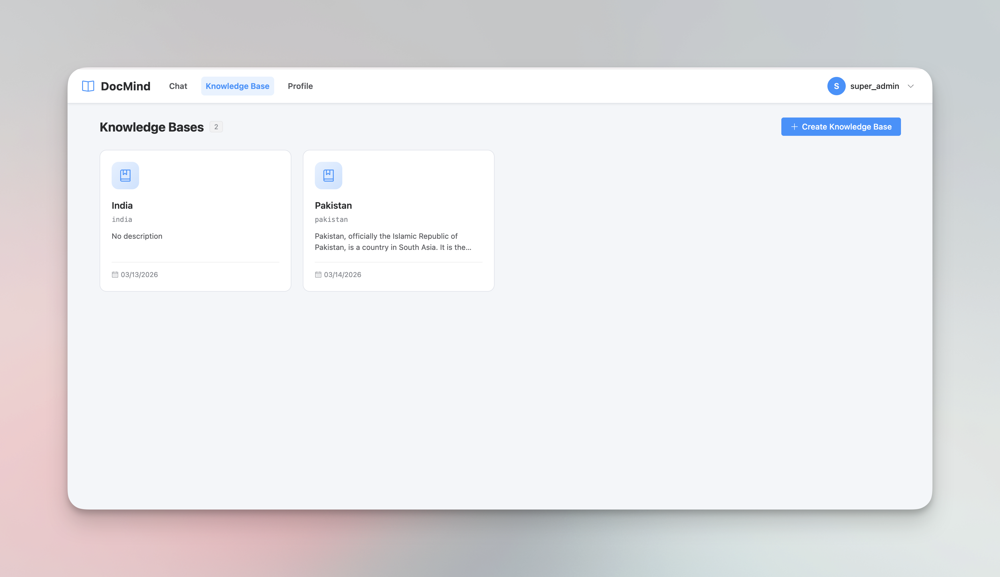
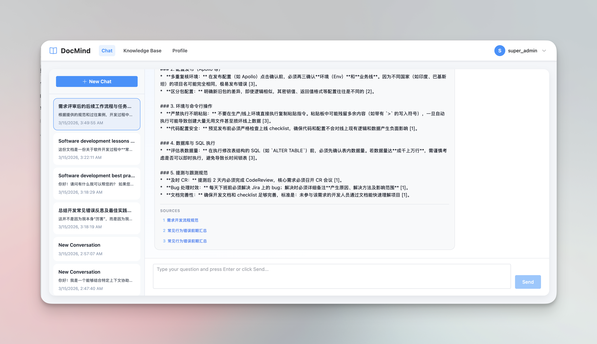

# DocMind

A robust, multi-tenant RAG (Retrieval-Augmented Generation) Knowledge Base system. DocMind seamlessly handles document ingestion, vector storage, and conversational retrieval with proper user data isolation.

## Screenshots

**Knowledge Base Dashboard**



**Document Management**


**Conversational Chat with Source Citations**



## Key Features

- **Multi-Tenant Architecture**: User registration, JWT-based authentication, and role-based access control (user / admin / super-admin) with proper data isolation.
- **Advanced RAG Pipelines**: Orchestrated via **LangGraph** for both document ingestion and conversational retrieval workflows.
- **Relational Metadata Management**: Uses SQLite to track Users, Knowledge Bases, Documents, and Chat Sessions with full history.
- **High-Performance Vector Search**: Uses **Qdrant** for scalable similarity search with dynamic collection creation per knowledge base (`docmind_{kb_name}`).
- **Flexible LLM & Embeddings**: OpenAI-compatible endpoints for both LLM and embeddings — swap providers (Ollama, OpenAI, OpenRouter, etc.) by changing environment variables only.
- **Streaming Chat**: Server-Sent Events (SSE) support for real-time token-by-token response streaming.
- **Full-Stack Application**: Vue 3 frontend with a complete UI covering authentication, knowledge base management, document ingestion, and conversational chat.

## Architecture & Tech Stack

### Backend
- **Framework**: Python 3.12+, FastAPI, Pydantic, Uvicorn
- **Package Manager**: `uv`
- **Workflow Orchestration**: LangGraph, LangChain
- **Vector Database**: Qdrant (Docker)
- **Embedding Model**: Any OpenAI-compatible endpoint (default: Ollama `nomic-embed-text`)
- **LLM**: Any OpenAI-compatible endpoint (default: OpenRouter `google/gemini-2.5-flash`)
- **Relational DB**: SQLite

### Frontend
- **Framework**: Vue 3 (Composition API)
- **Build Tool**: Vite 8
- **UI Components**: Element Plus
- **State Management**: Pinia
- **Routing**: Vue Router 5
- **CSS**: Tailwind CSS
- **Package Manager**: pnpm

## Advanced Ingestion & Preprocessing Pipeline

DocMind features a highly optimized, LangGraph-orchestrated document ingestion pipeline that addresses critical pain points in standard RAG architectures.

### 1. Strict Context-Preserving Chunking
* **Pain Point**: Traditional character-based splitters often slice through code blocks or separate paragraphs from their parent headers, causing context loss during retrieval.
* **Solution**: Custom state-machine-based Markdown splitter that slices by physical paragraphs (`\n\n`), dynamically tracks heading hierarchy and injects it into chunk metadata, and protects code blocks from being broken apart.

### 2. LLM-Powered Code Summarization (Multi-Vector Retrieval)
* **Pain Point**: Raw code lacks natural language characteristics, causing semantic dilution when vectorized — users querying in natural language often miss the right code snippets.
* **Solution**: A dedicated LangGraph node intercepts chunks containing code, generates a keyword-dense natural language summary via LLM, and uses the summary for embedding while storing the original code in Qdrant metadata payload. Retrieval matches the summary vector but returns the intact original code to the LLM.

### 3. Graceful Degradation & Fault Tolerance
* **Pain Point**: External LLM calls during ingestion can fail due to rate limits or timeouts.
* **Solution**: The summarization step falls back to standard text embedding for any chunk where the LLM call fails, without disrupting the rest of the ingestion process.

## Project Structure

```text
DocMind/
├── backend/                  # Backend application
│   ├── docmind/
│   │   ├── api/              # FastAPI routers (auth, chat, chats, ingest, kb) + middleware
│   │   ├── auth/             # JWT authentication and RBAC
│   │   ├── core/             # Config, logging, LLM/embedding clients, exception handling
│   │   ├── db/               # SQLite setup, DDL models, repositories
│   │   ├── ingestion/        # LangGraph ingestion workflow (chunking, summarization, vectorization)
│   │   ├── retrieval/        # LangGraph retrieval workflow (RAG, streaming, session titles)
│   │   └── vectorstore/      # Qdrant abstraction layer
│   ├── scripts/              # Database migration and ingestion utility scripts
│   ├── data/                 # SQLite and Qdrant volume data
│   ├── logs/                 # Application rotating logs
│   ├── Makefile              # Helper commands
│   ├── docker-compose.yml    # Infrastructure (Qdrant & Ollama)
│   └── pyproject.toml        # Python dependencies
└── frontend/                 # Vue 3 frontend application
    ├── src/
    │   ├── api/              # Axios API modules (auth, kb, ingest, chats)
    │   ├── components/       # UI components (auth, chat, ingestion, kb, layout)
    │   ├── stores/           # Pinia stores (auth, kb)
    │   ├── views/            # Page views (Dashboard, Chat, KB detail, Document detail, etc.)
    │   └── router/           # Vue Router configuration with navigation guards
    └── package.json
```

## Quick Start

### 1. Prerequisites

- [Docker & Docker Compose](https://docs.docker.com/get-docker/) — for running Qdrant and Ollama
- [uv](https://github.com/astral-sh/uv) — Python package manager
- [pnpm](https://pnpm.io/) — frontend package manager

### 2. Start Infrastructure

All backend commands should be run from the `backend/` directory:

```bash
cd backend
```

**First time only** (creates containers and pulls the embedding model):
```bash
make infra-init
```

**Subsequent runs**:
```bash
make infra-up
```

### 3. Configure Environment

```bash
cp .env.example .env
```

Edit `.env` and set the required values — at minimum:

| Variable                | Description                                                                                                |
| ----------------------- | ---------------------------------------------------------------------------------------------------------- |
| `LLM_API_KEY`           | API key for your LLM provider (e.g. OpenRouter key)                                                        |
| `LLM_MODEL`             | Model name (default: `google/gemini-2.5-flash`)                                                            |
| `LLM_BASE_URL`          | OpenAI-compatible endpoint (default: `https://openrouter.ai/api/v1`)                                       |
| `EMBEDDING_BASE_URL`    | Embedding endpoint (default: `http://localhost:11434/v1` for Ollama)                                       |
| `EMBEDDING_MODEL`       | Embedding model (default: `nomic-embed-text:latest`)                                                       |
| `JWT_SECRET_KEY`        | Random secret for signing JWTs — generate with: `python -c "import secrets; print(secrets.token_hex(32))"` |
| `SUPER_ADMIN_USERNAMES` | Comma-separated usernames that get super-admin privileges                                                  |

See `.env.example` for all available options including chunking, retrieval, and logging settings.

### 4. Run the Backend

```bash
make dev
```

The API server will be available at `http://localhost:8000`.
Interactive API docs: `http://localhost:8000/docs`

### 5. Run the Frontend

```bash
cd frontend
pnpm install
pnpm dev
```

The frontend will be available at `http://localhost:5173`. It connects to the backend at `http://localhost:8000` by default (configure via `VITE_API_URL` if needed).

## API Reference

DocMind exposes a complete RESTful API. Key endpoints:

| Method   | Endpoint                       | Description                                           |
| -------- | ------------------------------ | ----------------------------------------------------- |
| `POST`   | `/auth/register`               | Register a new user                                   |
| `POST`   | `/auth/login`                  | Login and obtain a JWT                                |
| `GET`    | `/kb`                          | List accessible knowledge bases                       |
| `POST`   | `/kb`                          | Create a knowledge base (super-admin only)            |
| `DELETE` | `/kb/{kb_id}`                  | Delete a knowledge base (super-admin only)            |
| `POST`   | `/ingest/{kb_id}`              | Upload and ingest a document (async, background task) |
| `GET`    | `/ingest/documents/kb/{kb_id}` | List documents in a knowledge base                    |
| `GET`    | `/ingest/{doc_id}/chunks`      | View processed chunks for a document                  |
| `DELETE` | `/ingest/{doc_id}`             | Delete a document                                     |
| `POST`   | `/chat`                        | Query a knowledge base (non-streaming)                |
| `POST`   | `/chat/stream`                 | Query a knowledge base (SSE streaming)                |
| `GET`    | `/chats`                       | List chat sessions                                    |
| `GET`    | `/chats/{session_id}`          | Get chat session with message history                 |
| `GET`    | `/health`                      | Health check (Qdrant + LLM connectivity)              |

## Utility Commands

| Command                                           | Description                                              |
| ------------------------------------------------- | -------------------------------------------------------- |
| `make dev`                                        | Start API server with hot reload                         |
| `make infra-init`                                 | **First time**: create containers + pull embedding model |
| `make infra-up`                                   | Start existing containers                                |
| `make infra-down`                                 | Stop containers (keeps data volumes)                     |
| `make ingest FILE=path/to/file.md TITLE="My Doc"` | Ingest a file via CLI script                             |
| `docker compose ps`                               | Check container status                                   |
| `docker compose down -v`                          | Stop containers and delete volumes (data loss)           |

## Roadmap

- [ ] **Document Storage with MinIO** — Persist uploaded documents to an object store during ingestion, exposing a download endpoint for users to retrieve original files.
- [x] **Frontend UI** — Responsive Vue 3 web interface covering knowledge base management, document ingestion, and conversational chat.
- [x] **LLM-based Document Pre-processing** — Pre-ingestion pipeline using LLM to generate code summaries and improve chunking quality before vectorization.
